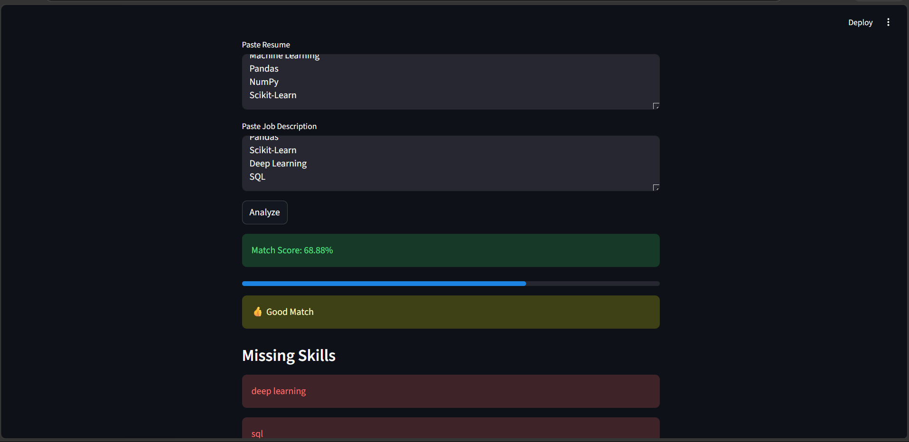

# 🤖 AI Resume Screening System

An AI-powered Resume Screening System built using Natural Language Processing (NLP) and Machine Learning. The application analyzes resumes against job descriptions, calculates similarity scores using TF-IDF and Cosine Similarity, identifies relevant skills, and provides resume-job fit insights.

## 🚀 Live Demo

https://ai-resume-screening-system-ewtpninmfushdjqtetuwu8.streamlit.app/

---

## 📌 Features

- Resume and Job Description Matching
- TF-IDF Based Text Vectorization
- Cosine Similarity Score Calculation
- Skill Extraction and Matching
- Resume Relevance Analysis
- Interactive Streamlit User Interface
- Real-time Resume Evaluation

---

## 🛠️ Tech Stack

- Python
- Streamlit
- Scikit-Learn
- NLP
- TF-IDF Vectorizer
- Cosine Similarity
- NumPy
- Pandas

---

## 📊 System Workflow

Resume Text
↓
Text Preprocessing
↓
TF-IDF Vectorization
↓
Cosine Similarity Calculation
↓
Skill Matching
↓
Resume Score Generation
↓
Recommendations & Insights

---

## 📂 Project Structure

```text
AI-Resume-Screening-System/
│
├── app.py
├── AI_Resume_Screener.ipynb
├── Output.png
├── requirements.txt
└── README.md
```

## ⚙️ Installation

Clone the repository:

```bash
git clone https://github.com/Isha4002/AI-Resume-Screening-System.git
cd AI-Resume-Screening-System
```

Install dependencies:

```bash
pip install -r requirements.txt
```

Run the application:

```bash
streamlit run app.py
```

---

## 💡 How It Works

1. Enter Resume Content.
2. Enter Job Description.
3. Click **Analyze**.
4. The system calculates similarity between the resume and job description.
5. Relevant skills are identified.
6. A matching score and recommendations are generated.

---

## 🎯 Future Enhancements

- PDF Resume Upload Support
- ATS Compatibility Analysis
- Resume Section Detection
- Transformer-Based Models (BERT)
- Personalized Career Recommendations
- Multi-Job Matching Support

---

## Application Preview



---

## 👩‍💻 Author

**Isha Pal**

- GitHub: https://github.com/Isha4002
- LinkedIn: https://linkedin.com/in/your-linkedin-profile

---

## ⭐ Key Learning Outcomes

- Natural Language Processing (NLP)
- Information Retrieval Techniques
- TF-IDF Vectorization
- Cosine Similarity
- Streamlit Deployment
- Machine Learning Application Development

---

⭐ If you found this project useful, consider giving it a star!

